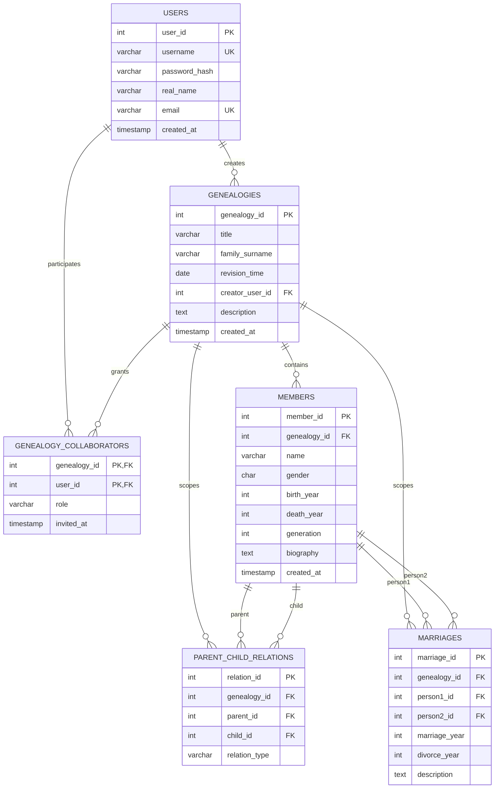

# 报告材料：ER 图、关系模型与范式分析

本文档用于课程实验报告中“数据库设计”和“范式分析”部分，可以直接复制到最终报告，再配合系统截图、SQL 执行截图和性能测试截图排版。

## 1. 当前完成状态

已完成：

```text
数据库表结构、索引、触发器
核心递归查询 SQL
小数据、演示数据和 10 万级数据生成
COPY 批量导入
分支导出
EXPLAIN ANALYZE 性能测试
Qt/C++ 桌面端主程序
登录注册、族谱管理、成员管理、关系维护
Dashboard、树形预览、祖先查询、亲缘链路查询
```

待整理：

```text
最终实验报告截图
最终演示讲解顺序
```

## 2. ER 图

以下 ER 图使用 Mermaid 语法描述。可以在支持 Mermaid 的 Markdown 预览器中渲染，也可以复制到 Mermaid Live Editor 导出图片。



## 3. 实体与联系说明

`users` 表保存系统登录用户。每个用户可以创建多个族谱，也可以通过协作者表参与其他用户创建的族谱。

`genealogies` 表保存族谱基本信息。一个族谱包含多个成员、亲子关系和婚姻关系。

`genealogy_collaborators` 表表示用户和族谱之间的多对多协作关系。复合主键为 `(genealogy_id, user_id)`，`role` 限定为 `editor` 或 `viewer`。

`members` 表保存族谱中的人物节点。人物属于且只属于一个族谱，姓名不要求全局唯一，因为族谱中可能存在重名成员。

`parent_child_relations` 表表示成员之间的亲子关系，是 `members` 表上的自关联。`relation_type` 区分 `father` 和 `mother`，并通过唯一约束保证一个孩子最多只有一条父亲记录和一条母亲记录。

`marriages` 表表示成员之间的婚姻关系，也是 `members` 表上的自关联。触发器会统一夫妻双方 ID 顺序，避免 `(A, B)` 和 `(B, A)` 重复保存。

## 4. 关系模型

关系模式如下，`PK` 表示主键，`FK` 表示外键，`UK` 表示唯一约束。

```text
users(
  user_id PK,
  username UK,
  password_hash,
  real_name,
  email UK,
  created_at
)

genealogies(
  genealogy_id PK,
  title,
  family_surname,
  revision_time,
  creator_user_id FK -> users(user_id),
  description,
  created_at
)

genealogy_collaborators(
  genealogy_id PK, FK -> genealogies(genealogy_id),
  user_id PK, FK -> users(user_id),
  role,
  invited_at
)

members(
  member_id PK,
  genealogy_id FK -> genealogies(genealogy_id),
  name,
  gender,
  birth_year,
  death_year,
  generation,
  biography,
  created_at
)

parent_child_relations(
  relation_id PK,
  genealogy_id FK -> genealogies(genealogy_id),
  parent_id FK -> members(member_id),
  child_id FK -> members(member_id),
  relation_type,
  UK(child_id, relation_type)
)

marriages(
  marriage_id PK,
  genealogy_id FK -> genealogies(genealogy_id),
  person1_id FK -> members(member_id),
  person2_id FK -> members(member_id),
  marriage_year,
  divorce_year,
  description,
  UK(genealogy_id, person1_id, person2_id)
)
```

## 5. 主键、外键与业务约束

主键设计：

- `users.user_id`、`genealogies.genealogy_id`、`members.member_id`、`parent_child_relations.relation_id`、`marriages.marriage_id` 使用代理主键，便于程序引用和外键关联。
- `genealogy_collaborators` 使用 `(genealogy_id, user_id)` 作为复合主键，天然表示“一个用户在一个族谱中只能有一条协作记录”。

外键设计：

- `genealogies.creator_user_id` 关联创建者。
- `members.genealogy_id` 关联成员所属族谱。
- `parent_child_relations.parent_id` 和 `child_id` 均关联成员表。
- `marriages.person1_id` 和 `person2_id` 均关联成员表。
- 主要外键使用 `ON DELETE CASCADE`，删除族谱时自动删除其成员、关系和协作者记录。

检查约束和触发器：

- `members.gender` 限定为 `M` 或 `F`。
- `members.birth_year <= members.death_year`。
- `members.generation >= 1`。
- `parent_child_relations.parent_id <> child_id`。
- `parent_child_relations.relation_type` 限定为 `father` 或 `mother`。
- 亲子关系触发器检查父母与子女属于同一族谱、父亲性别为男、母亲性别为女、父母出生年份早于子女、父母世代小于子女。
- 婚姻关系触发器检查双方属于同一族谱，并统一 `person1_id < person2_id` 的存储顺序。

## 6. 函数依赖分析

### users

主要函数依赖：

```text
user_id -> username, password_hash, real_name, email, created_at
username -> user_id, password_hash, real_name, email, created_at
```

`user_id` 是主键，`username` 是候选键。`email` 具有唯一约束，但允许为空，报告中可作为非空时的候选键说明。

### genealogies

主要函数依赖：

```text
genealogy_id -> title, family_surname, revision_time, creator_user_id, description, created_at
```

族谱标题和姓氏不唯一，不能作为键。

### genealogy_collaborators

主要函数依赖：

```text
(genealogy_id, user_id) -> role, invited_at
```

复合主键完整决定协作角色和邀请时间。

### members

主要函数依赖：

```text
member_id -> genealogy_id, name, gender, birth_year, death_year, generation, biography, created_at
```

姓名、出生年份和世代都不能唯一确定成员，所以不作为候选键。

### parent_child_relations

主要函数依赖：

```text
relation_id -> genealogy_id, parent_id, child_id, relation_type
(child_id, relation_type) -> relation_id, genealogy_id, parent_id
```

`relation_id` 是主键，`(child_id, relation_type)` 是候选键，用于保证一个孩子最多一位父亲和一位母亲。

### marriages

主要函数依赖：

```text
marriage_id -> genealogy_id, person1_id, person2_id, marriage_year, divorce_year, description
(genealogy_id, person1_id, person2_id) -> marriage_id, marriage_year, divorce_year, description
```

`marriage_id` 是主键，`(genealogy_id, person1_id, person2_id)` 是候选键。触发器统一双方顺序后，该唯一约束可以避免重复婚姻记录。

## 7. 3NF 与 BCNF 分析

第一范式：

所有表的字段均为原子值。例如亲子关系和婚姻关系没有以逗号分隔的列表形式存储，而是拆分为独立关系表，因此满足 1NF。

第二范式：

除 `genealogy_collaborators` 外，各表主要使用单字段主键，不存在非主属性对主键的一部分依赖。`genealogy_collaborators` 的非主属性 `role`、`invited_at` 依赖完整复合主键 `(genealogy_id, user_id)`，不依赖其中任一部分，因此满足 2NF。

第三范式：

各表中的非主属性不依赖其他非主属性。例如用户真实姓名不决定邮箱，族谱标题不决定创建者，成员姓名不决定出生年份，婚姻年份不决定离婚年份。关系表中的属性由主键或候选键直接决定，没有传递依赖，因此满足 3NF。

BCNF：

在单表关系模式自身的键约束下，主要非平凡函数依赖的决定因素均为超键：

- `users` 的决定因素为 `user_id` 或 `username`。
- `genealogies` 的决定因素为 `genealogy_id`。
- `genealogy_collaborators` 的决定因素为 `(genealogy_id, user_id)`。
- `members` 的决定因素为 `member_id`。
- `parent_child_relations` 的决定因素为 `relation_id` 或 `(child_id, relation_type)`。
- `marriages` 的决定因素为 `marriage_id` 或 `(genealogy_id, person1_id, person2_id)`。

因此，上述关系模式满足 BCNF。

需要说明的是，`parent_child_relations` 和 `marriages` 中保留了 `genealogy_id` 字段。这个字段可由成员所属族谱间接校验，但项目为了查询过滤、级联管理和数据隔离明确保存了它，并通过触发器保证与成员表一致。报告中可以说明这是受约束的工程化冗余，不影响单表键依赖分析，同时能提升按族谱查询关系数据的效率。

## 8. 索引设计

索引文件为 `sql/02_indexes.sql`，主要索引用途如下：

```text
idx_genealogies_creator              按创建者加载族谱
idx_members_genealogy                按族谱加载成员列表
idx_members_genealogy_generation     按族谱和世代统计、排序
idx_members_name_trgm                成员姓名模糊查询
idx_parent_child_parent_id           查询某成员子女
idx_parent_child_child_id            查询某成员父母
idx_parent_child_genealogy           按族谱过滤亲子关系
idx_marriages_person1                查询成员婚姻关系
idx_marriages_person2                查询成员婚姻关系
```

`idx_members_name_trgm` 使用 PostgreSQL `pg_trgm` 扩展和 GIN 索引，适合 `LIKE '%关键字%'` 类型的姓名模糊查询。性能对比脚本为 `sql/07_performance_explain.sql`。

## 9. 报告截图建议

最终报告建议补充以下截图：

```text
数据库建表、索引、触发器执行成功截图
项目构建成功截图
登录/注册界面截图
Dashboard 统计截图
族谱管理截图
成员列表和模糊查询截图
亲子关系维护截图
婚姻关系维护截图
树形预览截图
祖先查询截图
亲缘链路查询截图
10 万级数据生成和 COPY 导入截图
分支导出文件截图
EXPLAIN ANALYZE 性能测试截图
```
